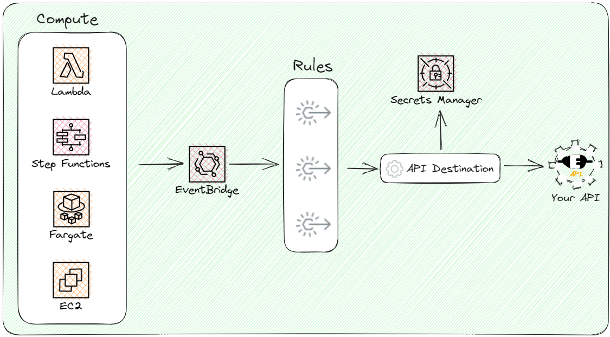

# OpenAPI to EventBridge API Destinations GitHub Action

This GitHub Action parses an OpenAPI specification to generate an AWS CloudFormation template that contains EventBridge API Destinations and associated triggers.



If you want to make asynchronous calls to your API via EventBridge, you're in the right spot. This GitHub action will take your API definition document (in Open API Specification 3.0+) and convert it to a CloudFormation template you can immediately deploy into your AWS account. It will configure EventBridge rules to call your API via an API destination. Leaving you with the easy task of dropping an event on an event bus to trigger it!

## What you need to know

* Your API spec must have [operation ids](https://swagger.io/docs/specification/paths-and-operations/#operationId) for each endpoint you wish to turn into an API destination
    * This is used to uniquely identify your endpoints and will be the `detailType` of the generated EventBridge rule
* This currently only works for APIs that utilize *API keys for auth*
* EventBridge API Destinations cost $0.20/million invocations
* All path and query parameters must be defined in your API specification
* Additional headers are not yet supported
* Path and query parameters will be automatically mapped and transformed as long as they are included **in the root** of your event.
* The payload of your API requests will come from a `message` property on your events. For more information, check out the [examples](#example)
* These are asynchronous invocations. You will not receive a response when you publish an event.

## Usage

Add this action to your GitHub Actions workflow by referencing it:

```yaml
- name: Generate CloudFormation from OpenAPI spec
  uses: allenheltondev/openapi-to-eventbridge-action@v1
  with:
    specPath: path/to/openapi/spec.yaml
    httpMethods: POST,DELETE,PUT
    resourcePrefix: MYAPP
    outputFilename: template.yaml
```

If you'd like to add the resources to an existing CloudFormation or SAM template, you can add the `blueprint` parameter with a path to your existing template:

```yaml
- name: Generate CloudFormation from OpenAPI spec
  uses: allenheltondev/openapi-to-eventbridge-action@v1
  with:
    specPath: path/to/openapi/spec.yaml
    blueprint: path/to/template.yaml
    environment: prod
    httpMethods: POST,DELETE,PUT
    resourcePrefix: MYAPP
    outputFilename: template.yaml
```

## Inputs

| Name            | Description                                                                                                      | Required |
|-----------------|------------------------------------------------------------------------------------------------------------------|----------|
| `specPath`      | Path to the OpenAPI spec.                                                                                        | ✅       |
| `blueprint`     | Path to template file you'd like to use as a basis. Useful if you have authentication parameters to provide.     | ❌       |
| `environment`   | Value in the *Description* field of a server in your OpenAPI spec. Used to get the base path for the API destinations. Defaults to the first server if none is provided. |❌|
| `httpMethods`   | Comma-separated list of HTTP methods to convert to API Destinations (e.g. "GET,POST,PUT,DELETE").                | ❌       |
| `resourcePrefix`| Prefix to use for all generated resources.                                                                       | ❌       |
| `outputFilename`| The filename for the generated output. If not provided, a default name will be used.                             | ❌       |

## Outputs

- The action will generate an AWS CloudFormation template with the EventBridge API Destinations and associated triggers based on the provided OpenAPI spec.

## Example

Here's a simple example of how you might use this action:

```yaml
name: Generate EventBridge Resources

on:
  push:
    branches:
      - main

jobs:
  generate:
    runs-on: ubuntu-latest

    steps:
    - name: Checkout code
      uses: actions/checkout@v2

    - name: Generate CloudFormation from OpenAPI spec
      uses: allenheltondev/openapi-to-eventbridge-action@v1
      with:
        specPath: openapi/spec.yml
        environment: stage
        httpMethods: "GET,POST"
        resourcePrefix: "myApp_"
        outputFilename: "template.yaml"
```

For an example output file, check out the [example yaml](/examples/example.yaml).

### Example Event

Imagine you have a POST endpoint that accepts a JSON object with a single property of "name". In your API spec, you've given this endpoint an `operationId` of *createPlayer* and it accepts a query string parameter of `validUntil` with an ISO8601 date that sets the expiration date of the player (maybe this is used for testing purposes with an auto-cleanup). Once the EventBridge rule and API destination are created in your AWS account, you could hit this endpoint with the following code using the AWS SDK v3 for JavaScript (you can use whatever language you'd like though).

```javascript
import { EventBridgeClient, PutEventsCommand } from '@aws-sdk/client-eventbridge';
const events = new EventBridgeClient(config);
await events.send(new PutEventsCommand({
  Entries: [
    {
      Source: 'test-app',
      DetailType: 'createPlayer',
      Detail: JSON.stringify({
        validUntil: '2025-01-01T23:59:59Z',
        message: {
          name: "Jerry S"
        }
      })
    }
  ]
}));
```

## Contributing

If you'd like to contribute to the development of this GitHub Action, please create a pull request.

© Allen Helton - Ready, Set, Cloud!
